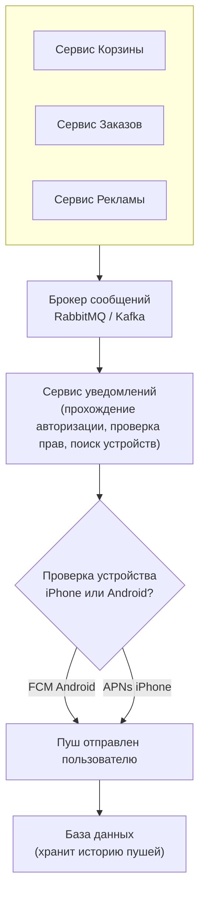

```mermaid
flowchart TD
subgraph Sources[" "]
        direction RL
        Cart["Сервис Корзины"]
        Order["Сервис Заказов"]
        Marketing["Сервис Рекламы"]
    end
Sources --> Broker

Broker["Брокер сообщений<br/>RabbitMQ / Kafka"]

Broker --> Notification
Notification["Сервис уведомлений<br/>(прохождение авторизации, проверка прав, поиск устройств)"]

Notification --> CheckDevice

CheckDevice{"Проверка устройства<br/>iPhone или Android?"}


CheckDevice -->|FCM Android| Merge
CheckDevice -->|APNs iPhone| Merge

Merge["Пуш отправлен пользователю"]

Merge --> DB

DB["База данных<br/>(хранит историю пушей)"]
```
